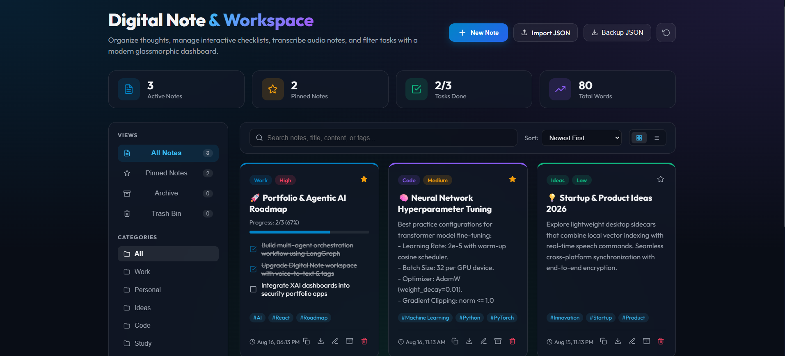

# 🚀 Digital Note & Workspace

An agentic, modern, glassmorphic **Digital Note & Task Workspace** built with **Next.js 14 (App Router)**, **React 18**, and **Vanilla CSS**. Designed for effortless note-taking, voice transcription, interactive checklist tracking, multi-dimensional filtering, and seamless data export/import.


<br/>



---

## ✨ Features

- **🎙️ Voice Dictation (Speech-to-Text)**: Powered by the Web Speech API (`SpeechRecognition`) for real-time hands-free audio note transcription directly into your notes.
- **✅ Interactive Checklists & Task Progress**: Build interactive to-do checklists with live task completion percentages and dynamic visual progress bars.
- **🎨 Glassmorphic Dark UI System**: Modern UI featuring ambient radial gradient lighting, backdrop blur effects (`backdrop-filter`), smooth hover micro-animations, and curated accent colors.
- **🏷️ Multi-Dimensional Filtering & Search**:
  - Filter by **Category** (*Work*, *Personal*, *Ideas*, *Code*, *Study*).
  - Filter by **Priority** (*High*, *Medium*, *Low*).
  - Filter by **Tags** with dynamic tag cloud selection.
  - View tabs for **All Notes**, **Pinned Notes**, **Archived Notes**, and **Trash Bin**.
  - Instant full-text search across titles, content, categories, and tags.
- **📊 Real-Time Workspace Metrics**: Header statistics dashboard tracking active notes, pinned notes, completed task ratios, and total word count.
- **🔀 Responsive Grid & List View Layouts**: Toggle between multi-column grid and streamlined list views at any time.
- **💾 LocalStorage & SSR Hydration Protection**: Automatic persistent local storage saving with built-in Next.js SSR hydration mismatch protection.
- **📦 Data Export & Import**:
  - Download individual notes as clean **Markdown (`.md`)** files.
  - Copy note content & checklists directly to clipboard.
  - Export and restore complete workspace backups via **JSON (`.json`)**.

---

## 🛠️ Tech Stack

- **Framework**: [Next.js 14 (App Router)](https://nextjs.org/)
- **Core Library**: React 18
- **Icons**: Feather Icons via [`react-icons/fi`](https://react-icons.github.io/react-icons/)
- **Typography**: Google Fonts (`Outfit` & `Poppins`)
- **Styling**: Pure CSS / Glassmorphism Design Tokens

---

## 🚀 Getting Started

### Prerequisites

Ensure you have **Node.js 18.x** or higher installed on your machine.

### Installation

1. **Clone the repository**:
   ```bash
   git clone <repository-url>
   cd "To-Do list 0"
   ```

2. **Install dependencies**:
   ```bash
   npm install
   ```

3. **Run the development server**:
   ```bash
   npm run dev
   ```

4. **Open in browser**:
   Navigate to [http://localhost:3000](http://localhost:3000) (or `http://localhost:3001` if port 3000 is occupied).

---

## 📂 Project Structure

```text
├── app/
│   ├── globals.css     # Global glassmorphic styles, dark tokens & animations
│   ├── layout.js      # Root layout with font optimization & SEO metadata
│   └── page.js        # Main Digital Workspace component ('use client')
├── public/            # Static assets
├── next.config.mjs    # Next.js configuration
├── package.json       # Project dependencies & scripts
├── .gitignore         # Build & node_modules exclusions
└── README.md          # Project documentation
```

---

## 💡 Available Scripts

In the project directory, you can run:

- `npm run dev`: Starts the Next.js development server.
- `npm run build`: Compiles and builds the application for production.
- `npm start`: Runs the built production server.

---

## 📄 License

This project is open source and available under the [MIT License](LICENSE).
